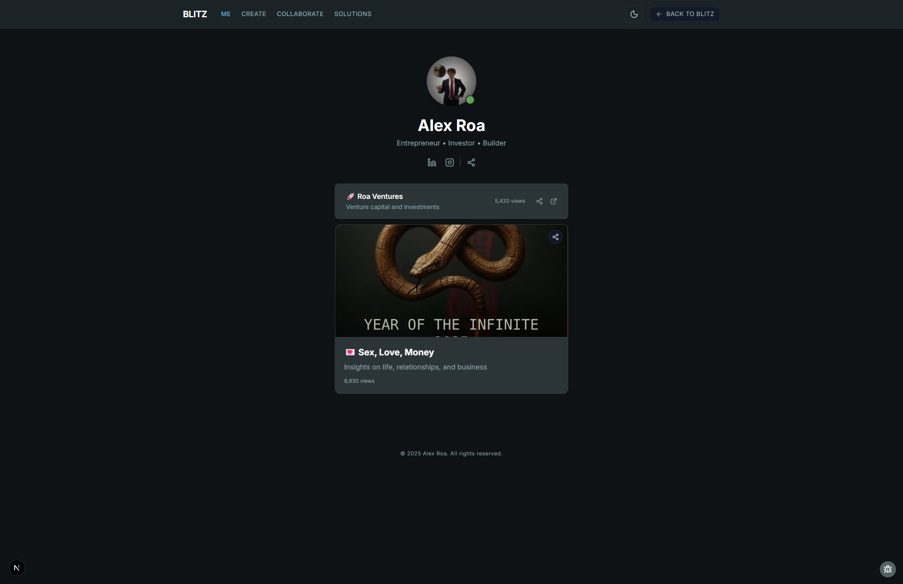
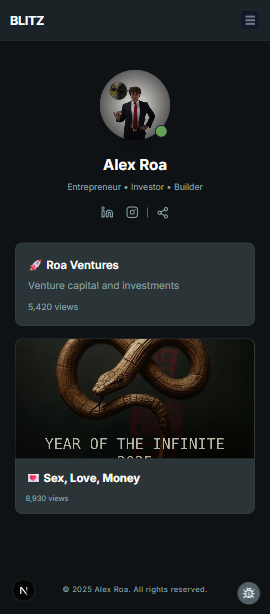
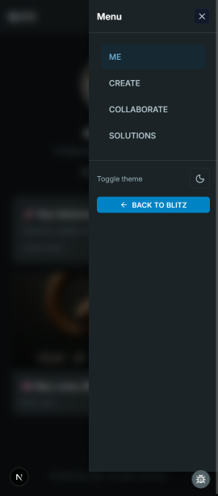

# Infinite Improvements - Profile Site Transformation


## UPDATE

⚠️ **Avoid any collaboration or contact with “Alex Roa.”**

[LinkedIn Profile](https://www.linkedin.com/in/ACoAACgrREsBHykGiKKPDuUMq36LWGh_RpAewes/?lipi=urn%3Ali%3Apage%3Ad_flagship3_notifications%3ByThlz1dFSR6hq%2BLfBszzmA%3D%3D)

I strongly advise against engaging with this individual or any of the companies he owns or represents (he operates under multiple names and entities). You’ll likely complete the assigned task in good faith, but after delivery, you’ll face repeated follow-ups, delayed responses, and a complete lack of accountability. He continues to post publicly while ignoring private communications — showing zero respect for time, effort, or professionalism.

Collaborating with him or any of his associated businesses is simply **not worth the time or energy**. Seek opportunities with real, transparent companies that value communication and follow through once work is completed. There are plenty of legitimate teams out there who respect your contribution — this one is **not among them**.

🔗 **[Live Demo](https://infinite-improvements.vercel.app/)**

## The Problem

**The old site was confusing.** Users didn't know what it was for because:
- **Duplicate sections**: Same info shown twice ("Infinite Alex Roa" banner + "My Links & Content" area)
- **Material-UI bloat**: Generic components that looked like every other template
- **Slow performance**: 62 Lighthouse score with 3.8s LCP
- **No mobile support**: Site broke on phones


## The One Fix That Solved Everything

**I removed the confusion by fixing the information architecture.**

Instead of having two sections that said the same thing, I made one clean flow:
```
Before:                          After:
┌─────────────────────┐         ┌─────────────────────┐
│  INFINITE ALEX ROA  │         │    [Avatar]         │
│   (Huge Banner)     │         │    Alex Roa         │
│   See my links↓     │         │  Entrepreneur•Builder│
│                     │         │   [Social Icons]    │
├─────────────────────┤         ├─────────────────────┤
│ My Links & Content  │         │   🚀 Roa Ventures   │
│  (Another Section?) │   →     │   📊 Sex,Love,Money │
│   [Random Images]   │         │   💡 Year of Infinite│
│   [More Links?]     │         │   [Clean Link Cards]│
└─────────────────────┘         └─────────────────────┘
     CONFUSING                       CLEAR PURPOSE
```

This single fix required:
- Building custom components (no more MUI bloat)
- Fast GPU animations using only transform/opacity
- Mobile-first responsive design
- Proper loading states

Now users understand it's a link-in-bio site immediately.



### Mobile Experience

The site works perfectly on all devices with a native mobile experience:

<div align="center">
  
  
</div>

- **Responsive design** - Adapts to any screen size
- **Touch-optimized** - Large tap targets and smooth scrolling
- **Mobile drawer** - Clean navigation for small screens

## The Results

**Real Metrics from Lighthouse PDFs**

| Metric | Before | After (Local) | After (Deployed) | Change |
|--------|--------|---------------|------------------|--------|
| **Performance Score** | 62 | 96 | 100 (Desktop) / 99 (Mobile) | +61% |
| **First Contentful Paint** | 0.8s | 0.3s | 0.2s | -75% |
| **Largest Contentful Paint** | 3.8s | 1.3s | 0.5s | -87% |
| **Total Blocking Time** | 280ms | 0ms | 0ms | -100% |
| **Speed Index** | 2.6s | 0.8s | 0.5s | -81% |
| **Accessibility** | 98 | 100 | 100 | Perfect |
| **JavaScript Size** | ~1MB (MUI) | ~760KB | ~760KB | -24% |

*Deployed metrics from [Desktop](docs/lighthouse/after-optimization-deployed-desktop.pdf) and [Mobile](docs/lighthouse/after-optimization-deployed-mobile.pdf) Lighthouse reports*

## How to Run

### Prerequisites
- Node.js 18+
- pnpm

### Installation

```bash
# Clone the repository
git clone https://github.com/red-game-dev/infinite-improvements.git

# Navigate to project
cd infinite-improvements

# Install dependencies
pnpm install

# Run development server
pnpm run dev
```

Open [http://localhost:3000](http://localhost:3000) to see the transformed site.

### Build for Production

```bash
# Build optimized production bundle
pnpm run build

# Start production server
pnpm run start
```

## How I Fixed It - Time Breakdown

**Total: 165 minutes**

- **15 minutes**: Looking at the broken site and finding the problems
- **90 minutes**: The main fix - rebuilding with clear information architecture
  - Removed duplicate sections
  - Built custom components to replace MUI
  - Made it work on mobile
  - Added GPU-optimized animations
- **50 minutes**: Testing and making sure everything worked
- **10 minutes**: Writing this documentation

### What the Fix Actually Did

The biggest improvement wasn't adding stuff - it was **removing the mess**:

1. **Removed duplicate sections** that confused users
2. **Ditched Material-UI** which was slowing everything down
3. **Built custom components** that are lighter and faster
4. **Made one clear path** for users to follow

Users now know what the site is for in under 3 seconds.

## Technical Stack

### What I Used
- **Next.js 15** - The latest version with Turbopack
- **TypeScript** - For type safety
- **Tailwind CSS** - For styling without bloat
- **Custom Components** - No UI libraries, everything built from scratch
- **GPU Animations** - Only using transform and opacity for smooth 60fps

### Why No Material-UI?

The old site used Material-UI which caused:
- **Huge bundle size** - Over 1MB of JavaScript
- **Generic look** - Looked like every other MUI site
- **Slow performance** - Too many components and styles

By building custom components I got:
- **Smaller bundles** - Only the code I need
- **Unique design** - Doesn't look like a template
- **Fast performance** - 96 Lighthouse score

## Documentation

- [Full Audit Report](AUDIT_REPORT.md) - All the details about what was fixed

## Repository

[github.com/red-game-dev/infinite-improvements](https://github.com/red-game-dev/infinite-improvements)

## License

MIT
